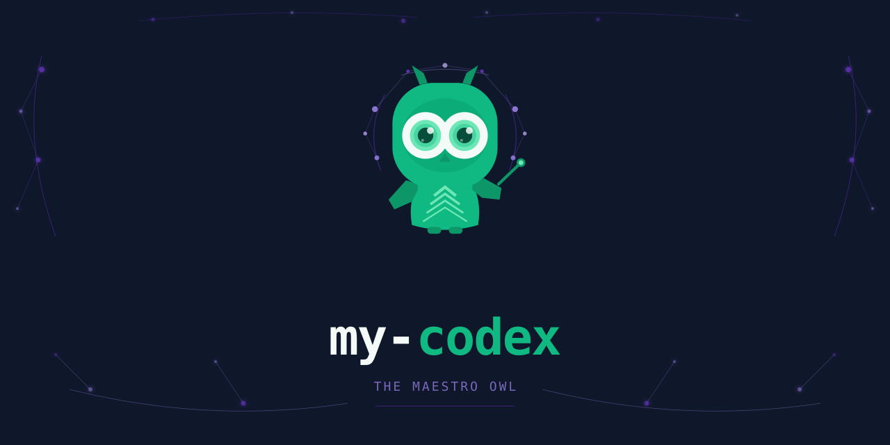

[English](./README.md) | [한국어](./docs/i18n/README.ko.md) | [日本語](./docs/i18n/README.ja.md) | [中文](./docs/i18n/README.zh.md) | [Deutsch](./docs/i18n/README.de.md) | [Français](./docs/i18n/README.fr.md)

> [](https://github.com/sehoon787/my-claude) Looking for Claude Code? → **my-claude** — same Boss orchestration in native Claude `.md` agent format

---

<div align="center">

# my-codex


**All-in-one agent harness for OpenAI Codex CLI.**
**Install once, 17 curated agents ready.**

Boss auto-discovers every agent and skill at runtime,
then routes your task to the right specialist via `spawn_agent`. No config. No boilerplate.



</div>

---

## Installation

### For Humans

```bash
curl -fsSL https://raw.githubusercontent.com/sehoon787/my-codex/main/install.sh | bash
```

Clone-based install:

```bash
git clone --depth 1 https://github.com/sehoon787/my-codex.git /tmp/my-codex
bash /tmp/my-codex/install.sh
rm -rf /tmp/my-codex
```

Windows note:
- `install.sh` patches the npm-managed `codex`, `codex.cmd`, and `codex.ps1` shims when they exist, so the my-codex vault pipeline still has wrapper fallback coverage even if `%APPDATA%\npm` resolves before `~/.codex/bin`.

### For AI Agents

```
Read https://raw.githubusercontent.com/sehoon787/my-codex/main/AI-INSTALL.md and follow every step.
```

---

## How Boss Works

Boss is the meta-orchestrator at the core of my-codex. It never writes code — it discovers, classifies, matches, delegates, and verifies.

```
User Request
     │
     ▼
┌─────────────────────────────────────────────┐
│  Phase 0 · DISCOVERY                        │
│  Scan ~/.codex/agents/*.toml at runtime     │
│  → Build live capability registry           │
└──────────────────────┬──────────────────────┘
                       ▼
┌─────────────────────────────────────────────┐
│  Phase 1 · INTENT GATE                      │
│  Classify: trivial | build | refactor |     │
│  mid-sized | architecture | research | ...  │
│  → Counter-propose skill if better fit      │
└──────────────────────┬──────────────────────┘
                       ▼
┌─────────────────────────────────────────────┐
│  Phase 2 · CAPABILITY MATCHING              │
│  P1: Exact skill match                      │
│  P2: Specialist agent via spawn_agent       │
│  P3: Multi-agent orchestration              │
│  P4: General-purpose fallback               │
└──────────────────────┬──────────────────────┘
                       ▼
┌─────────────────────────────────────────────┐
│  Phase 3 · DELEGATION                       │
│  spawn_agent with structured instructions   │
│  TASK / OUTCOME / TOOLS / DO / DON'T / CTX  │
└──────────────────────┬──────────────────────┘
                       ▼
┌─────────────────────────────────────────────┐
│  Phase 4 · VERIFICATION                     │
│  Read changed files independently           │
│  Run tests, lint, build                     │
│  Cross-reference with original intent       │
│  → Retry up to 3× on failure               │
└─────────────────────────────────────────────┘
```

### Priority Routing

Boss cascades every request through a priority chain until the best match is found:

| Priority | Match Type | When | Example |
|:--------:|-----------|------|---------|
| **P1** | Skill match | Task maps to a self-contained skill | `"review this diff"` → /review skill |
| **P2** | Specialist agent | Domain-specific agent exists | `"security audit"` → security-reviewer |
| **P3a** | Boss direct | 2–4 independent agents | `"fix 3 bugs"` → parallel spawn |
| **P3b** | Sub-orchestrator | Complex multi-step workflow | `"refactor + test"` → Sisyphus |
| **P4** | Fallback | No specialist matches | `"explain this"` → general agent |

### Model Routing

| Complexity | Model | Used For |
|-----------|-------|----------|
| Deep analysis, architecture | gpt-5.6-sol (high reasoning) | Boss, Oracle, Sisyphus, Atlas |
| Standard implementation | gpt-5.6-terra (medium) | executor, debugger, security-reviewer |
| Quick lookup, exploration | gpt-5.6-luna (low) | explore, simple advisory |

### 3-Phase Sprint Workflow

For end-to-end feature implementation, Boss orchestrates a structured sprint:

```
Phase 1: DESIGN         Phase 2: EXECUTE        Phase 3: REVIEW
(interactive)            (autonomous)             (interactive)
─────────────────────   ─────────────────────   ─────────────────────
User decides scope      executor runs tasks     Compare vs design doc
Engineering review      Auto code review        Present comparison table
Confirm "design done"   Architect verification  User: approve / improve
```

### Structured Final Report

Boss closes every working turn — any turn that edited files, made commits/PRs, changed configuration, or ran verification — with a structured final report the reader can scan without opening a diff. The report is assembled from five fixed tables, each emitted only when its situation actually occurred (never an empty table):

| Situation | Table | Columns |
|-----------|-------|---------|
| Files/settings changed | Changes | Target / Before / After / Rationale |
| Multiple tasks completed | Work summary | Item / Result / Evidence |
| Verification was run | Verification | Item / Expected / Actual / Verdict |
| Commits/PRs produced | Deliverables | PR / Repo / Content / Status |
| Anything unresolved | Remaining | Item / Status / Next step |

It fires only at the very end of reasoning — never as a mid-task progress update — and pure Q&A turns end normally without it. The spec ships in `boss.toml`'s developer instructions. (In the sibling [my-claude](https://github.com/sehoon787/my-claude), a Stop hook additionally enforces it; the Codex CLI has no equivalent enforcement point, so here the spec is prompt-level.)

---

## Architecture

```
┌─────────────────────────────────────────────────────┐
│                    User Request                       │
└───────────────────────┬─────────────────────────────┘
                        ▼
┌─────────────────────────────────────────────────────┐
│  Boss · Meta-Orchestrator (gpt-5.6-sol high)              │
│  Discovery → Classification → Matching → Delegation  │
└──┬──────────┬──────────┬──────────┬─────────────────┘
   │          │          │          │
   ▼          ▼          ▼          ▼
┌──────┐ ┌────────┐ ┌────────┐ ┌────────┐
│ P3a  │ │  P3b   │ │  P1/P2 │ │Config  │
│Direct│ │Sub-orch│ │ Skill/ │ │Control │
│2-4   │ │Sisyphus│ │ Agent  │ │config. │
│spawn │ │Atlas   │ │ Direct │ │toml    │
└──────┘ └────────┘ └────────┘ └────────┘
┌─────────────────────────────────────────────────────┐
│  Agent Layer (17 installed TOML files)                │
│  Boss 1 · OMO 9 · OMX 7                               │
│  + 2 opt-in agent packs (17 agents, off by default)   │
├─────────────────────────────────────────────────────┤
│  Skills Layer (123 from ECC + gstack + superpowers)   │
│  coding-standards · security-scan · deep-research     │
│  /review · /qa · /cso · /ship                         │
├─────────────────────────────────────────────────────┤
│  MCP Layer                                            │
│  Context7 · Exa · grep.app                            │
└─────────────────────────────────────────────────────┘
```

---

## What's Inside

| Category | Count | Source |
|----------|------:|--------|
| **Core agents** (always loaded) | 17 | Boss 1 + OMO 9 + OMX 7 |
| **Agent packs** (opt-in, none enabled by default) | 17 | 2 vendored categories: data-ai 13 + llmops 4 |
| **Skills** | 123 | ECC 79 · gstack 27 · Superpowers 13 · Core 4 |
| **MCP Servers** | 3 | Context7, Exa, grep.app |
| **config.toml** | 1 | my-codex |
| **AGENTS.md** | 1 | my-codex |

<details>
<summary><strong>Core Agent — Boss meta-orchestrator (1)</strong></summary>

| Agent | Model | Role | Source |
|-------|-------|------|--------|
| Boss | gpt-5.6-sol high | Dynamic runtime discovery → capability matching → optimal routing. Never writes code. | my-codex |

</details>

<details>
<summary><strong>OMO Agents — Sub-orchestrators and specialists (9)</strong></summary>

| Agent | Model | Role | Source |
|-------|-------|------|--------|
| Sisyphus | gpt-5.6-sol high | Intent classification → specialist delegation → verification | [oh-my-openagent](https://github.com/code-yeongyu/oh-my-openagent) |
| Hephaestus | gpt-5.6-sol high | Autonomous explore → plan → execute → verify | oh-my-openagent |
| Atlas | gpt-5.6-sol high | Task decomposition + 4-stage QA verification | oh-my-openagent |
| Oracle | gpt-5.6-sol high | Strategic technical consulting (read-only) | oh-my-openagent |
| Metis | gpt-5.6-sol high | Intent analysis, ambiguity detection | oh-my-openagent |
| Momus | gpt-5.6-sol high | Plan feasibility review | oh-my-openagent |
| Prometheus | gpt-5.6-sol high | Interview-based detailed planning | oh-my-openagent |
| Librarian | gpt-5.6-terra medium | Open-source documentation search via MCP | oh-my-openagent |
| Multimodal-Looker | gpt-5.6-terra medium | Image/screenshot/diagram analysis | oh-my-openagent |

</details>

<details>
<summary><strong>OMX Agents — Specialist workers (7)</strong></summary>

Converted from [oh-my-codex](https://github.com/Yeachan-Heo/oh-my-codex) `prompts/*.md` to Codex TOML. Only the lanes `templates/codex-AGENTS.md` advertises are converted — the allowlist lives in `scripts/skill-allowlists.sh`.

| Agent | Sandbox | Role | Source |
|-------|---------|------|--------|
| executor | workspace-write | Code implementation | oh-my-codex |
| planner | workspace-write | Implementation planning | oh-my-codex |
| architect | read-only | System design and architecture | oh-my-codex |
| test-engineer | workspace-write | Test strategy and coverage | oh-my-codex |
| security-reviewer | read-only | Security analysis | oh-my-codex |
| code-reviewer | read-only | Focused code review | oh-my-codex |
| debugger | workspace-write | Root cause analysis | oh-my-codex |

</details>

<details>
<summary><strong>Agent Packs — Opt-in AI specialists (2 packs, 17 agents)</strong></summary>

Vendored from [awesome-codex-subagents](https://github.com/VoltAgent/awesome-codex-subagents) (MIT) into `codex-agents/packs/` and installed to `~/.codex/agent-packs/`. **No pack is enabled by default** — opt in explicitly:

```bash
# View current state
~/.codex/bin/my-codex-packs status

# Enable a pack immediately
~/.codex/bin/my-codex-packs enable data-ai

# Switch profiles at install time
bash /tmp/my-codex/install.sh --profile minimal   # no packs
bash /tmp/my-codex/install.sh --profile dev       # data-ai + llmops
bash /tmp/my-codex/install.sh --profile full      # every installed pack
```

| Pack | Count | Agents |
|------|------:|--------|
| data-ai | 13 | ai-engineer, data-analyst, data-engineer, data-scientist, database-optimizer, llm-architect, machine-learning-engineer, ml-engineer, mlops-engineer, nlp-engineer, postgres-pro, prompt-engineer, reinforcement-learning-engineer |
| llmops | 4 | ai-observability-engineer, eval-engineer, hallucination-investigator, prompt-regression-tester |

</details>

<details>
<summary><strong>Skills — 123 from 4 sources</strong></summary>

Curated per-skill allowlists live in `scripts/skill-allowlists.sh` — that file is the authority for what ships.

| Source | Count | Key Skills |
|--------|------:|------------|
| [everything-claude-code](https://github.com/affaan-m/everything-claude-code) | 79 | coding-standards, python-testing, api-design, deep-research |
| [gstack](https://github.com/garrytan/gstack) | 27 | /qa, /review, /ship, /cso, /investigate, /office-hours |
| [superpowers](https://github.com/obra/superpowers) | 13 | brainstorming, systematic-debugging, TDD, writing-plans |
| [my-codex Core](https://github.com/sehoon787/my-codex) | 4 | boss-advanced, boss-briefing, briefing-vault, gstack-sprint |

gstack is counted as 26 allowlisted skills plus the repo root entry; the whole gstack repo also lives at `~/.codex/skills/gstack` as its canonical runtime tree.

Codex ships **no document skills** — there is no `pdf`, `docx`, `pptx`, or `xlsx` skill in this bundle.

</details>

<details>
<summary><strong>MCP Servers (3)</strong></summary>

| Server | Purpose | Cost |
|--------|---------|------|
|  [Context7](https://mcp.context7.com) | Real-time library documentation | Free |
|  [Exa](https://mcp.exa.ai) | Semantic web search | Free 1k req/month |
|  [grep.app](https://mcp.grep.app) | GitHub code search | Free |

</details>

---

##  Briefing Vault

Obsidian-compatible persistent memory. Every project maintains a `.briefing/` directory that updates during Codex sessions via native plugin hooks, with wrapper fallback for session start/end continuity.

```
.briefing/
├── INDEX.md                          ← Project context (auto-created once)
├── state.json                        ← Session metadata, counters, lastVaultSync (auto-managed)
├── sessions/
│   ├── YYYY-MM-DD-<topic>.md        ← Human/agent-written follow-up session summary
│   └── YYYY-MM-DD-auto.md           ← Auto-generated scaffold (recorded files, filtered status, follow-up)
├── decisions/
│   └── YYYY-MM-DD-<decision>.md     ← Human/agent-written decision record
├── learnings/
│   ├── YYYY-MM-DD-<pattern>.md      ← Human/agent-written learning note
│   └── YYYY-MM-DD-auto-session.md   ← Auto-generated scaffold (files, wrapper activity, prompts)
├── references/
│   └── auto-links.md                ← Reserved for collected research links
├── archives/                         ← PARA: completed/inactive notes (flat)
├── wiki/                             ← LLM-wiki: concept pages
│   └── _schema.md
├── agents/
│   ├── agent-log.jsonl              ← Wrapper/session log
│   └── YYYY-MM-DD-summary.md        ← Daily logged-signal breakdown
└── persona/
    ├── profile.md                   ← Routing/profile summary from logged signals
    ├── suggestions.jsonl            ← Routing suggestions (auto-generated)
    ├── persona-policy.json          ← Accepted soft routing preferences for Boss
    └── rules/                       ← Workflow pattern rules (workflow-*.md)
```

### Sub-Vaults

| Path | Description |
|------|-------------|
| `INDEX.md` | Project overview with links to recent decisions and learnings. Auto-created on first session, refreshed periodically. |
| `sessions/` | **Session summaries.** `*-auto.md` — auto-generated scaffold refreshed during the session and finalized at stop using recorded session files, filtered status, and logged signals. `<topic>.md` — human or agent-written follow-up session summary prompted by the vault reminders. |
| `decisions/` | **Architecture and design decisions** with rationale. Write these as durable notes when a decision is important enough to keep. |
| `learnings/` | **Patterns, gotchas, non-obvious solutions.** `*-auto-session.md` — auto-generated scaffold refreshed during the session with the session's recorded file list, logged signals, and prompts for follow-up notes. `<topic>.md` — human or agent-written learning note. |
| `references/` | **Web research URLs.** `references/auto-links.md` is updated from `WebSearch`/`WebFetch` hook activity when those native Codex hooks are available. |
| `agents/` | **Logged session signals.** `agent-log.jsonl` — enriched entries with `{ts, agent_id, agent_type, phase, seq, task_hint}`. `YYYY-MM-DD-summary.md` — daily logged-signal breakdown derived from that log. |
| `persona/` | **User work style profile.** `profile.md` — routing/profile summary derived from logged signals. `suggestions.jsonl` — routing recommendations. `persona-policy.json` — accepted soft routing preferences. `rules/workflow-*.md` — workflow sequence pattern rules proposed by `/boss-briefing`. |
| `state.json` | Session metadata: counters, lastVaultSync, sessionStartHead. Auto-managed by hooks. |
| `archives/` | PARA Archives — completed sessions (30+ days), superseded decisions, inactive learnings |
| `wiki/` | LLM-wiki concept pages — distilled knowledge from multiple sessions |

### Knowledge Management (v2)

BriefingVault v2 integrates three knowledge management methodologies:

| Methodology | Applied As |
|------------|-----------|
| **PARA** (Tiago Forte) | Directory structure: sessions=Projects, decisions=Areas, references=Resources, archives=Archives |
| **Zettelkasten** (Luhmann) | Atomic notes in `learnings/`, unique IDs (`YYYYMMDDHHMMSS`), enforced `[[wiki-links]]` |
| **LLM-wiki** (Karpathy) | Concept pages in `wiki/` — auto-suggested when keywords appear 3+ times |

Codex CLI session-end hooks automatically:
- Suggest archiving notes older than 30 days
- Propose wiki pages for frequently mentioned concepts
- Generate unique Zettelkasten IDs for new notes

### Session-Specific Diffs

At session start, my-codex saves the current git HEAD and a snapshot of the working tree state. During the session, native Codex hooks refresh `.briefing` scaffolds after prompts, edits, searches, and subagent completions. At session end, the final scaffold summarizes diff and status only for recorded paths, while filtering hook-created noise such as `.briefing/` artifacts and session-start `.gitignore` edits.

This keeps the scaffold focused on session-owned work instead of dumping the entire repository status. For non-git projects, a `YYYY-MM-DD:cwd` identifier is used as fallback.

### Using with Obsidian

1. Open Obsidian → **Open folder as vault** → select `.briefing/`
2. Notes appear in graph view, linked by `[[wiki-links]]`
3. YAML frontmatter (`date`, `type`, `tags`) enables structured search
4. Timeline scaffolds for sessions and learnings build automatically; follow-up summaries, decisions, and learning notes accumulate as you write them

### /boss-briefing

Run `/boss-briefing` during or at the end of a session to:
- **Sync vault**: Update profile.md, INDEX.md, and agent summaries
- **Detect workflow patterns**: Analyze temporal agent call sequences across sessions
- **Recover from gaps**: Generate recovery summaries if days have passed since the last session
- **Propose persona rules**: Suggest workflow-based routing preferences (not just frequency)
- **Validate session notes**: Check that today's session has a proper summary

The Stop hook checks whether `/boss-briefing` has run today. If not, it blocks session end with a reminder. The existing `stop-profile-update.js` continues to run as a fallback.

### Behavioral Hooks

| Hook | Event | Behavior |
|------|-------|----------|
| Session Setup | SessionStart | Auto-detects tools + injects Briefing Vault context |
| Delegation Guard | PreToolUse | Blocks Boss from directly modifying files |
| Agent Telemetry | PostToolUse | Logs agent usage to analytics |
| Vault Enforcer | PostToolUse | Counts edits, warns if no vault entries |
| Subagent Logger | SubagentStop | Logs agent execution to Briefing Vault |
| Vault Reminder | UserPromptSubmit | Suggests /boss-briefing after 5+ messages |
| Completion Check | Stop | Runs profile fallback + guards /boss-briefing |
| Teammate Guide | TeammateIdle | Prompts leader on idle teammates |
| Quality Gate | TaskCompleted | Verifies deliverable quality |

---

## Upstream Open-Source Sources

my-codex tracks **4 upstream submodules**, plus one vendored snapshot, two adapted/sister projects, and one companion CLI:

| # | Source | Method | What It Provides |
|---|--------|--------|-----------------|
| 1 |  **[everything-claude-code](https://github.com/affaan-m/everything-claude-code)** — affaan-m | submodule | 79 allowlisted skills across development workflows. Claude Code-specific content stripped; generic coding skills retained. |
| 2 |  **[gstack](https://github.com/garrytan/gstack)** — garrytan | submodule | 27 skills for code review, QA, security audit, deployment. Includes Playwright browser daemon. |
| 3 |  **[oh-my-codex](https://github.com/Yeachan-Heo/oh-my-codex)** — Yeachan Heo | submodule | 7 allowlisted worker agents (executor, planner, architect, test-engineer, security-reviewer, code-reviewer, debugger), converted from Markdown prompts to Codex TOML. |
| 4 |  **[superpowers](https://github.com/obra/superpowers)** — Jesse Vincent | submodule | 13 skills covering brainstorming, TDD, systematic debugging, and plan writing. No agents installed. |
| 5 |  **[awesome-codex-subagents](https://github.com/VoltAgent/awesome-codex-subagents)** — VoltAgent | vendored (MIT) | 17 AI/LLM agents snapshotted into `codex-agents/packs/` as 2 opt-in packs (data-ai 13, llmops 4). Submodule removed 2026-07-27. |
| 6 |  **[oh-my-openagent](https://github.com/code-yeongyu/oh-my-openagent)** — code-yeongyu | adapted | 9 OMO agents (Sisyphus, Atlas, Oracle, etc.). Adapted to Codex-native TOML format and maintained in-repo. |
| 7 |  **[my-claude](https://github.com/sehoon787/my-claude)** — sehoon787 | sister project | Same Boss orchestration in native Claude `.md` agent format. Skills, rules, and briefing vault shared across both projects. |
| 8 |  **[codeburn](https://github.com/getagentseal/codeburn)** — getagentseal | npm CLI (MIT) | Local-first token/cost tracker. Parses `~/.codex/sessions` read-only — no proxy, no upload. Installed by `install.sh` (pinned `codeburn@0.9.23`), registered in `upstream/SOURCES.json` as `method: npm-cli`. No hooks on Codex. |

Every submodule is SHA-pinned in `upstream/SOURCES.json` (AI-BOM) — companion CLIs (ast-grep, codeburn) are version-pinned there too — which also records the two removed submodules (`agency-agents` — nothing vendored; `awesome-codex-subagents` — 17 agents vendored).

---

## GitHub Actions

| Workflow | Trigger | Purpose |
|----------|---------|---------|
| **CI** | push, PR | Validates TOML agent files, skill existence, and upstream file counts |
| **Smoke Tests** | push, PR | `hooks`, `shell`, `drift`, and `routing-refs` jobs — hook wiring, shell syntax, model drift, and AGENTS.md routing references |
| **Update Upstream** | every 3 days / manual | Security-gated `git submodule update --remote`, refreshes `upstream/SOURCES.json` pins, and creates an auto-merge PR |
| **Auto Tag** | push to main | Reads version from `config.toml` and creates git tag if new |
| **Pages** | push to main | Deploys `docs/index.html` to GitHub Pages |
| **CLA** | PR | Contributor License Agreement check |
| **Lint Workflows** | push, PR | Validates GitHub Actions workflow YAML syntax |

---

## my-codex Originals

Features built specifically for this project, beyond what upstream sources provide:

| Feature | Description |
|---------|-------------|
| **Boss Meta-Orchestrator** | Dynamic capability discovery → intent classification → 4-priority routing → delegation → verification |
| **3-Phase Sprint** | Design (interactive) → Execute (autonomous via executor) → Review (interactive vs design doc) |
| **Agent Tier Priority** | core > omo > omx > opt-in packs. Pack agents are skipped if their name collides with an already-installed agent. Most specialized agent wins. |
| **Cost Optimization** | gpt-5.6-luna for advisory, gpt-5.6-sol for implementation — automatic model routing across all 34 installed agents |
| **Briefing Signals** | Wrapper/session logging feeds `.briefing/agents/agent-log.jsonl`, daily summaries, and routing/profile hints |
| **Smart Packs** | Project-type detection recommends relevant agent packs at session start |
| **Agent Pack System** | On-demand domain specialist activation via `--profile` and `my-codex-packs` helper |
| **Codex Attribution** | git hooks record Codex-touched files and append `AI-Contributed-By: Codex` to commit messages |
| **CI Dedup Detection** | Automated duplicate TOML agent detection across upstream syncs |

---

## Installation Options

### Quick Install

```bash
git clone --depth 1 https://github.com/sehoon787/my-codex.git /tmp/my-codex
bash /tmp/my-codex/install.sh
rm -rf /tmp/my-codex
```

Re-running the same command refreshes to the latest `main` build, replaces only my-codex-managed files in `~/.codex/`, and removes stale skill copies from `~/.agents/skills/`.

### Agent Pack Profiles

Packs are installed but **inactive by default** — a fresh install enables none of them and records the empty set in `~/.codex/enabled-agent-packs.txt`. Opt in per pack, or pick a profile:

```bash
# Enable one pack immediately
~/.codex/bin/my-codex-packs enable data-ai

# Minimal profile (core agents only, no packs — the default)
bash /tmp/my-codex/install.sh --profile minimal

# Dev profile (data-ai + llmops)
bash /tmp/my-codex/install.sh --profile dev

# Full profile (all 2 installed pack categories enabled)
bash /tmp/my-codex/install.sh --profile full
```

### Codex Attribution System

`install.sh` installs a `codex` wrapper plus global git hooks in `~/.codex/git-hooks/`:

- **`prepare-commit-msg`** — Records files changed during a real Codex session
- **`commit-msg`** — Appends `Generated with Codex CLI: https://github.com/openai/codex` when staged files intersect the recorded change set
- **`post-commit`** — Adds `AI-Contributed-By: Codex` trailer to qualifying commits

Opt-in `Co-authored-by` trailer: set both `git config --global my-codex.codexContributorName '<label>'` and `my-codex.codexContributorEmail '<github-linked-email>'`. Disable entirely: `git config --global my-codex.codexAttribution false`. my-codex does **not** change `git user.name`, `git user.email`, or commit author identity.

### Agent TOML Format

Every agent is a native TOML file in `~/.codex/agents/`:

```toml
name = "debugger"
description = "Focused debugging specialist — traces failures to root cause"
model = "gpt-5.6-terra"
model_reasoning_effort = "medium"

[developer_instructions]
content = """
You are a debugging specialist. Analyze failures systematically:
1. Reproduce the issue
2. Isolate the root cause
3. Propose a minimal fix
4. Verify the fix does not break adjacent behavior
"""
```

### config.toml

Global Codex settings in `~/.codex/config.toml`:

```toml
[agents]
max_threads = 8
max_depth = 1
```

- `max_threads` — Maximum concurrent sub-agents
- `max_depth` — Maximum nesting depth for agent-spawns-agent chains

---

## Bundled Upstream Versions

Upstream sources managed as git submodules. Pinned commits tracked in `.gitmodules`.

| Source | Sync |
|--------|------|
| [everything-claude-code](https://github.com/affaan-m/everything-claude-code) | submodule (`upstream/ecc`) |
| [gstack](https://github.com/garrytan/gstack) | submodule (`upstream/gstack`) |
| [oh-my-codex](https://github.com/Yeachan-Heo/oh-my-codex) | submodule (`upstream/omx`) |
| [superpowers](https://github.com/obra/superpowers) | submodule (`upstream/superpowers`) |
| [awesome-codex-subagents](https://github.com/VoltAgent/awesome-codex-subagents) | vendored snapshot (submodule removed 2026-07-27) |

---

## FAQ

<details>
<summary><strong>How is my-codex different from my-claude?</strong></summary>

my-codex and my-claude share the same Boss orchestration architecture and upstream skill sources. The key difference is the runtime: my-codex targets OpenAI Codex CLI with native `.toml` agent format and `spawn_agent` delegation, while my-claude targets Claude Code with `.md` agent format and the Agent tool.

</details>

<details>
<summary><strong>Can I use both my-codex and my-claude?</strong></summary>

Yes. They install to separate directories (`~/.codex/` and `~/.claude/`) and do not conflict. Skills from shared upstream sources are adapted for each platform.

</details>

<details>
<summary><strong>How do agent packs work?</strong></summary>

Agent packs are domain-specific agent collections installed to `~/.codex/agent-packs/`. Two packs ship today — `data-ai` (13) and `llmops` (4) — and **none is enabled on install**. Use `my-codex-packs enable <pack>` to activate one, or reinstall with `--profile full` to enable both categories.

</details>

<details>
<summary><strong>How does upstream sync work?</strong></summary>

A GitHub Actions workflow runs every 3 days, pulling the latest commits from all 4 upstream submodules, refreshing the SHA pins in `upstream/SOURCES.json`, and creating a security-gated auto-merge PR. You can also trigger it manually from the Actions tab.

</details>

<details>
<summary><strong>What models does my-codex use?</strong></summary>

Boss and sub-orchestrators (Sisyphus, Atlas, Oracle) use gpt-5.6-sol with high reasoning effort. Standard workers use gpt-5.6-terra with medium reasoning. Lightweight advisory agents use gpt-5.6-luna.

Skills consume the SKILL.md standard as-is with no transformation; only agents are converted to Codex TOML, and the model tier for that conversion is managed from a single file, `scripts/model-tiers.sh`. When Codex ships its next model generation, update only that file — `scripts/md-to-toml.sh` and `install.sh` both source it.

</details>

---

## Troubleshooting

### Skills-only recovery

If a tool reports invalid `SKILL.md` files under `~/.agents/skills/`, the most common cause is a stale local copy or stale symlink target from an older install.

Remove the affected directories from `~/.agents/skills/` and matching entries under `~/.claude/skills/`, then reinstall:

```bash
npx skills add sehoon787/my-codex -y -g
```

If you use the full Codex bundle, rerun `install.sh` once as well. The full installer refreshes `~/.codex/skills/` and removes stale my-codex-managed copies under `~/.agents/skills/`.

---

## Contributing

Issues and PRs are welcome. When adding a new agent, add a `.toml` file to `codex-agents/core/` or `codex-agents/omo/` and update the agent list in `SETUP.md`. See [CONTRIBUTING.md](./CONTRIBUTING.md) for PR validation steps and Codex commit attribution behavior.

## Credits

Built on the work of: [my-claude](https://github.com/sehoon787/my-claude) (sehoon787), [everything-claude-code](https://github.com/affaan-m/everything-claude-code) (affaan-m), [gstack](https://github.com/garrytan/gstack) (garrytan), [oh-my-codex](https://github.com/Yeachan-Heo/oh-my-codex) (Yeachan Heo), [superpowers](https://github.com/obra/superpowers) (Jesse Vincent), [awesome-codex-subagents](https://github.com/VoltAgent/awesome-codex-subagents) (VoltAgent), [oh-my-openagent](https://github.com/code-yeongyu/oh-my-openagent) (code-yeongyu), [openai/skills](https://github.com/openai/skills) (OpenAI).

## License

MIT License. See the [LICENSE](./LICENSE) file for details.
