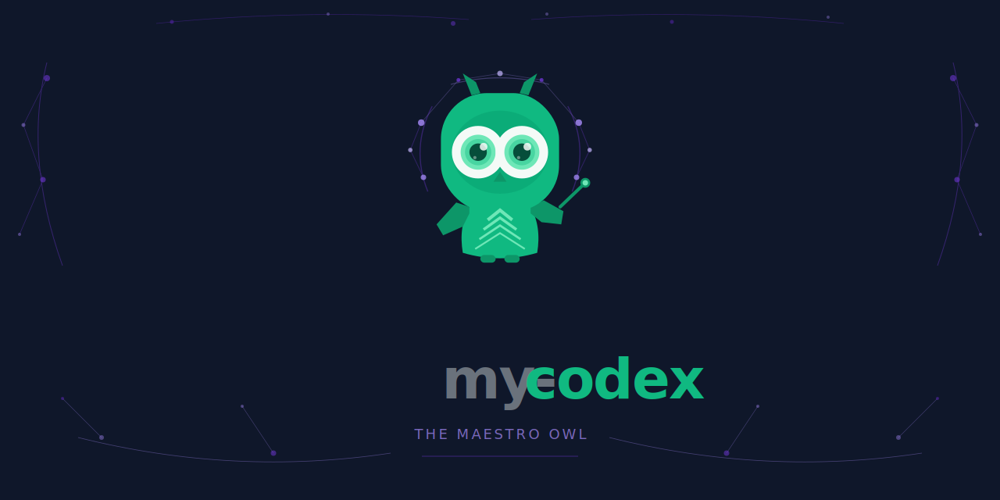

[English](../../README.md) | [한국어](./README.ko.md) | [日本語](./README.ja.md) | [中文](./README.zh.md) | [Deutsch](./README.de.md) | [Français](./README.fr.md)

> [](https://github.com/sehoon787/my-claude) Claude Code를 찾으시나요? → **my-claude** — 네이티브 Claude `.md` 에이전트 형식으로 제공하는 동일한 Boss 오케스트레이션

---

<div align="center">

# my-codex


**OpenAI Codex CLI를 위한 올인원 에이전트 하네스.**
**한 번 설치하면 330개 이상의 에이전트가 준비됩니다.**

Boss가 런타임에 모든 에이전트와 스킬을 자동으로 탐색하고,
`spawn_agent`를 통해 작업을 적합한 전문가에게 라우팅합니다. 설정도, 보일러플레이트도 없습니다.



</div>

---

## 설치

### 사람을 위한 설치

```bash
git clone --depth 1 https://github.com/sehoon787/my-codex.git /tmp/my-codex
bash /tmp/my-codex/install.sh
rm -rf /tmp/my-codex
```

### AI 에이전트를 위한 설치

```bash
curl -fsSL https://raw.githubusercontent.com/sehoon787/my-codex/main/install.sh | bash
```

---

## Boss의 작동 방식

Boss는 my-codex의 핵심에 있는 메타 오케스트레이터입니다. 코드를 직접 작성하지 않고, 탐색하고 분류하고 매칭하고 위임하고 검증합니다.

```
사용자 요청
     │
     ▼
┌─────────────────────────────────────────────┐
│  Phase 0 · DISCOVERY                        │
│  Scan ~/.codex/agents/*.toml at runtime     │
│  → Build live capability registry           │
└──────────────────────┬──────────────────────┘
                       ▼
┌─────────────────────────────────────────────┐
│  Phase 1 · INTENT GATE                      │
│  Classify: trivial | build | refactor |     │
│  mid-sized | architecture | research | ...  │
│  → Counter-propose skill if better fit      │
└──────────────────────┬──────────────────────┘
                       ▼
┌─────────────────────────────────────────────┐
│  Phase 2 · CAPABILITY MATCHING              │
│  P1: Exact skill match                      │
│  P2: Specialist agent via spawn_agent       │
│  P3: Multi-agent orchestration              │
│  P4: General-purpose fallback               │
└──────────────────────┬──────────────────────┘
                       ▼
┌─────────────────────────────────────────────┐
│  Phase 3 · DELEGATION                       │
│  spawn_agent with structured instructions   │
│  TASK / OUTCOME / TOOLS / DO / DON'T / CTX  │
└──────────────────────┬──────────────────────┘
                       ▼
┌─────────────────────────────────────────────┐
│  Phase 4 · VERIFICATION                     │
│  Read changed files independently           │
│  Run tests, lint, build                     │
│  Cross-reference with original intent       │
│  → Retry up to 3× on failure               │
└─────────────────────────────────────────────┘
```

### 우선순위 라우팅

Boss는 가장 적합한 매칭을 찾을 때까지 모든 요청을 우선순위 체인을 통해 순차적으로 처리합니다:

| 우선순위 | 매칭 유형 | 조건 | 예시 |
|:--------:|-----------|------|---------|
| **P1** | 스킬 매칭 | 작업이 독립적인 스킬에 해당 | `"merge PDFs"` → pdf 스킬 |
| **P2** | 전문가 에이전트 | 도메인별 에이전트 존재 | `"security audit"` → security-reviewer |
| **P3a** | Boss 직접 | 독립적인 에이전트 2~4개 | `"fix 3 bugs"` → 병렬 스폰 |
| **P3b** | 서브 오케스트레이터 | 복잡한 다단계 워크플로 | `"refactor + test"` → Sisyphus |
| **P4** | 폴백 | 전문가 매칭 없음 | `"explain this"` → 범용 에이전트 |

### 모델 라우팅

| 복잡도 | 모델 | 사용 대상 |
|-----------|-------|----------|
| 심층 분석, 아키텍처 | o3 (high reasoning) | Boss, Oracle, Sisyphus, Atlas |
| 표준 구현 | o3 (medium) | executor, debugger, security-reviewer |
| 빠른 조회, 탐색 | o4-mini (low) | explore, 간단한 자문 |

### 3단계 스프린트 워크플로

엔드투엔드 기능 구현을 위해 Boss는 구조화된 스프린트를 오케스트레이션합니다:

```
Phase 1: DESIGN         Phase 2: EXECUTE        Phase 3: REVIEW
(interactive)            (autonomous)             (interactive)
─────────────────────   ─────────────────────   ─────────────────────
User decides scope      executor runs tasks     Compare vs design doc
Engineering review      Auto code review        Present comparison table
Confirm "design done"   Architect verification  User: approve / improve
```

---

## 아키텍처

```
┌─────────────────────────────────────────────────────┐
│                    User Request                       │
└───────────────────────┬─────────────────────────────┘
                        ▼
┌─────────────────────────────────────────────────────┐
│  Boss · Meta-Orchestrator (o3 high)                   │
│  Discovery → Classification → Matching → Delegation  │
└──┬──────────┬──────────┬──────────┬─────────────────┘
   │          │          │          │
   ▼          ▼          ▼          ▼
┌──────┐ ┌────────┐ ┌────────┐ ┌────────┐
│ P3a  │ │  P3b   │ │  P1/P2 │ │Config  │
│Direct│ │Sub-orch│ │ Skill/ │ │Control │
│2-4   │ │Sisyphus│ │ Agent  │ │config. │
│spawn │ │Atlas   │ │ Direct │ │toml    │
└──────┘ └────────┘ └────────┘ └────────┘
┌─────────────────────────────────────────────────────┐
│  Agent Layer (330+ installed TOML files)              │
│  OMO 9 · OMX 33 · Awesome Core 54 · Superpowers 1   │
│  + 20 domain agent-packs (on-demand)                  │
├─────────────────────────────────────────────────────┤
│  Skills Layer (200+ from ECC + gstack + OMX + more)  │
│  tdd-workflow · security-review · autopilot           │
│  pdf · docx · pptx · xlsx · team                     │
├─────────────────────────────────────────────────────┤
│  MCP Layer                                            │
│  Context7 · Exa · grep.app                            │
└─────────────────────────────────────────────────────┘
```

---

## 구성 요소

| 카테고리 | 수량 | 출처 |
|----------|------:|--------|
| **핵심 에이전트** (항상 로드됨) | 98 | Boss 1 + OMO 9 + OMX 33 + Awesome Core 54 + Superpowers 1 |
| **에이전트 팩** (온디맨드) | 220+ | agency-agents + awesome-codex-subagents의 20개 도메인 카테고리 |
| **스킬** | 200+ | ECC 180+ · gstack 40 · OMX 36 · Superpowers 14 · Core 1 |
| **MCP 서버** | 3 | Context7, Exa, grep.app |
| **config.toml** | 1 | my-codex |
| **AGENTS.md** | 1 | my-codex |

<details>
<summary><strong>핵심 에이전트 — Boss 메타 오케스트레이터 (1)</strong></summary>

| 에이전트 | 모델 | 역할 | 출처 |
|-------|-------|------|--------|
| Boss | o3 high | 동적 런타임 탐색 → 역량 매칭 → 최적 라우팅. 코드를 직접 작성하지 않습니다. | my-codex |

</details>

<details>
<summary><strong>OMO 에이전트 — 서브 오케스트레이터 및 전문가 (9)</strong></summary>

| 에이전트 | 모델 | 역할 | 출처 |
|-------|-------|------|--------|
| Sisyphus | o3 high | 의도 분류 → 전문가 위임 → 검증 | [oh-my-openagent](https://github.com/code-yeongyu/oh-my-openagent) |
| Hephaestus | o3 high | 자율적 탐색 → 계획 → 실행 → 검증 | oh-my-openagent |
| Atlas | o3 high | 작업 분해 + 4단계 QA 검증 | oh-my-openagent |
| Oracle | o3 high | 전략적 기술 컨설팅 (읽기 전용) | oh-my-openagent |
| Metis | o3 high | 의도 분석, 모호성 탐지 | oh-my-openagent |
| Momus | o3 high | 계획 실현 가능성 검토 | oh-my-openagent |
| Prometheus | o3 high | 인터뷰 기반 세부 계획 수립 | oh-my-openagent |
| Librarian | o3 medium | MCP를 통한 오픈소스 문서 검색 | oh-my-openagent |
| Multimodal-Looker | o3 medium | 이미지/스크린샷/다이어그램 분석 | oh-my-openagent |

</details>

<details>
<summary><strong>OMC 에이전트 — 전문가 작업자 (19)</strong></summary>

| 에이전트 | 역할 | 출처 |
|-------|------|--------|
| analyst | 계획 전 사전 분석 | [oh-my-claudecode](https://github.com/Yeachan-Heo/oh-my-claudecode) |
| architect | 시스템 설계 및 아키텍처 | oh-my-claudecode |
| code-reviewer | 집중적인 코드 리뷰 | oh-my-claudecode |
| code-simplifier | 코드 단순화 및 정리 | oh-my-claudecode |
| critic | 비판적 분석, 대안 제안 | oh-my-claudecode |
| debugger | 집중적인 디버깅 | oh-my-claudecode |
| designer | UI/UX 디자인 가이드 | oh-my-claudecode |
| document-specialist | 문서 작성 | oh-my-claudecode |
| executor | 작업 실행 | oh-my-claudecode |
| explore | 코드베이스 탐색 | oh-my-claudecode |
| git-master | Git 워크플로 관리 | oh-my-claudecode |
| planner | 신속한 계획 수립 | oh-my-claudecode |
| qa-tester | 품질 보증 테스팅 | oh-my-claudecode |
| scientist | 연구 및 실험 | oh-my-claudecode |
| security-reviewer | 보안 리뷰 | oh-my-claudecode |
| test-engineer | 테스트 작성 및 유지 관리 | oh-my-claudecode |
| tracer | 실행 추적 및 분석 | oh-my-claudecode |
| verifier | 최종 검증 | oh-my-claudecode |
| writer | 콘텐츠 및 문서 작성 | oh-my-claudecode |

</details>

<details>
<summary><strong>Awesome Core 에이전트 (54) — awesome-codex-subagents 출처</strong></summary>

`~/.codex/agents/`에 4개 카테고리가 설치됩니다:

**01-core-development (12)**
accessibility-tester, ad-security-reviewer, agent-installer, api-designer, code-documenter, code-reviewer, dependency-manager, full-stack-developer, monorepo-specialist, performance-optimizer, refactoring-specialist, tech-debt-analyzer

**03-infrastructure (16)**
azure-infra-engineer, cloud-architect, container-orchestrator, database-architect, disaster-recovery-planner, edge-computing-specialist, infrastructure-as-code, kubernetes-operator, load-balancer-specialist, message-queue-designer, microservices-architect, monitoring-specialist, network-engineer, serverless-architect, service-mesh-designer, storage-architect

**04-quality-security (16)**
api-security-tester, chaos-engineer, compliance-auditor, contract-tester, data-privacy-officer, e2e-test-architect, incident-responder, load-tester, mutation-tester, penetration-tester, regression-tester, security-scanner, soc-analyst, static-analyzer, threat-modeler, vulnerability-assessor

**09-meta-orchestration (10)**
agent-organizer, capability-assessor, conflict-resolver, context-manager, execution-planner, multi-agent-coordinator, priority-manager, resource-allocator, task-decomposer, workflow-orchestrator

</details>

<details>
<summary><strong>Superpowers 에이전트 (1) — obra/superpowers 출처</strong></summary>

| 에이전트 | 역할 | 출처 |
|-------|------|--------|
| superpowers-code-reviewer | 브레인스토밍 및 TDD 검증을 포함한 포괄적인 코드 리뷰 | [superpowers](https://github.com/obra/superpowers) |

</details>

<details>
<summary><strong>에이전트 팩 — 온디맨드 도메인 전문가 (21개 카테고리)</strong></summary>

`~/.codex/agent-packs/`에 설치됩니다. 다음을 통해 관리:

```bash
# 현재 상태 확인
~/.codex/bin/my-codex-packs status

# 팩 즉시 활성화
~/.codex/bin/my-codex-packs enable marketing

# 설치 시 프로필 전환
bash /tmp/my-codex/install.sh --profile minimal
bash /tmp/my-codex/install.sh --profile full
```

| 팩 | 수량 | 예시 |
|------|------:|---------|
| engineering | 32 | 백엔드, 프론트엔드, 모바일, DevOps, AI, 데이터 |
| marketing | 27 | Douyin, Xiaohongshu, WeChat OA, TikTok, SEO |
| language-specialists | 27 | Python, Go, Rust, Swift, Kotlin, Java |
| specialized | 31 | 법률, 금융, 헬스케어, 워크플로 |
| game-development | 20 | Unity, Unreal, Godot, Roblox, Blender |
| infrastructure | 19 | Cloud, K8s, Terraform, Docker, SRE |
| developer-experience | 13 | MCP Builder, LSP, 터미널, Rapid Prototyper |
| data-ai | 13 | 데이터 엔지니어, ML, 데이터베이스, ClickHouse |
| specialized-domains | 12 | 공급망, 물류, 이커머스 |
| design | 11 | 브랜드, UI, UX, 비주얼 스토리텔링 |
| business-product | 11 | 프로덕트 매니저, 성장, 분석 |
| testing | 11 | API, 접근성, 성능, E2E, QA |
| sales | 8 | 딜 전략, 파이프라인, 아웃바운드 |
| paid-media | 7 | Google Ads, Meta Ads, 프로그래매틱 |
| research-analysis | 7 | 트렌드, 시장, 경쟁 분석 |
| project-management | 6 | Agile, Jira, 워크플로 |
| spatial-computing | 6 | XR, WebXR, AR/VR, visionOS |
| support | 6 | 고객 지원, 개발자 애드보커시 |
| academic | 5 | 유학, 기업 교육 |
| product | 5 | 프로덕트 관리, UX 리서치 |
| security | 5 | 침투 테스트, 컴플라이언스, 감사 |

</details>

<details>
<summary><strong>스킬 — 5개 출처에서 200개 이상</strong></summary>

| 출처 | 수량 | 주요 스킬 |
|--------|------:|------------|
| [everything-claude-code](https://github.com/affaan-m/everything-claude-code) | 180+ | tdd-workflow, autopilot, security-review, coding-standards |
| [oh-my-codex](https://github.com/Yeachan-Heo/oh-my-codex) | 36 | plan, team, trace, deep-dive, blueprint, ultrawork |
| [gstack](https://github.com/garrytan/gstack) | 40 | /qa, /review, /ship, /cso, /investigate, /office-hours |
| [superpowers](https://github.com/obra/superpowers) | 14 | brainstorming, systematic-debugging, TDD, parallel-agents |
| [my-codex Core](https://github.com/sehoon787/my-codex) | 1 | boss-advanced |

</details>

<details>
<summary><strong>MCP 서버 (3)</strong></summary>

| 서버 | 목적 | 비용 |
|--------|---------|------|
|  [Context7](https://mcp.context7.com) | 실시간 라이브러리 문서 | 무료 |
|  [Exa](https://mcp.exa.ai) | 시맨틱 웹 검색 | 월 1천 건 무료 |
|  [grep.app](https://mcp.grep.app) | GitHub 코드 검색 | 무료 |

</details>

---

##  Briefing Vault

Obsidian 호환 영구 메모리입니다. 모든 프로젝트는 세션에 걸쳐 자동으로 채워지는 `.briefing/` 디렉터리를 유지합니다.

```
.briefing/
├── INDEX.md                          ← 프로젝트 컨텍스트 (최초 자동 생성)
├── sessions/
│   ├── YYYY-MM-DD-<topic>.md        ← AI가 작성한 세션 요약 (강제)
│   └── YYYY-MM-DD-auto.md           ← 자동 생성 스캐폴드 (git diff, 에이전트 통계)
├── decisions/
│   ├── YYYY-MM-DD-<decision>.md     ← AI가 작성한 의사결정 기록
│   └── YYYY-MM-DD-auto.md           ← 자동 생성 스캐폴드 (커밋, 파일)
├── learnings/
│   ├── YYYY-MM-DD-<pattern>.md      ← AI가 작성한 학습 노트
│   └── YYYY-MM-DD-auto-session.md   ← 자동 생성 스캐폴드 (에이전트, 파일)
├── references/
│   └── auto-links.md                ← 웹 검색에서 자동 수집된 URL
├── agents/
│   ├── agent-log.jsonl              ← 서브에이전트 실행 텔레메트리
│   └── YYYY-MM-DD-summary.md        ← 일별 에이전트 사용 요약
└── persona/
    ├── profile.md                   ← 에이전트 친화도 통계 (자동 업데이트)
    ├── suggestions.jsonl            ← 라우팅 제안 (자동 생성)
    ├── rules/                       ← 승인된 라우팅 선호도
    └── skills/                      ← 승인된 페르소나 스킬
```

### 자동화 라이프사이클

| 단계 | 훅 이벤트 | 동작 |
|-------|-----------|-------------|
| **세션 시작** | `SessionStart` | `.briefing/` 구조 생성, 세션별 diff를 위한 git HEAD 해시 저장 |
| **작업 중** | `PostToolUse` Edit/Write | 파일 편집 횟수 추적; 5회에서 경고, 15회에서 decisions/learnings 미작성 시 차단 |
| **작업 중** | `PostToolUse` WebSearch/WebFetch | URL을 `references/auto-links.md`에 자동 수집 |
| **작업 중** | `SubagentStop` | 에이전트 실행을 `agents/agent-log.jsonl`에 기록 |
| **작업 중** | `UserPromptSubmit` (매 5번째) | 제한된 페르소나 프로필 업데이트 |
| **세션 종료** | `Stop` (1번째 훅) | 스캐폴드 자동 생성: `sessions/auto.md`, `learnings/auto-session.md`, `decisions/auto.md`, `persona/profile.md` |
| **세션 종료** | `Stop` (2번째 훅) | 파일 편집 횟수 ≥ 3인 경우 AI 작성 세션 요약 **강제** — 템플릿으로 세션 종료 차단 |

### 자동 생성 vs AI 작성

| 유형 | 파일 패턴 | 생성 주체 | 내용 |
|------|-------------|-----------|---------|
| **자동 스캐폴드** | `*-auto.md`, `*-auto-session.md` | Stop 훅 (Node.js) | Git diff 통계, 에이전트 사용량, 커밋 목록 — 데이터만 |
| **AI 요약** | `YYYY-MM-DD-<topic>.md` | 세션 중 AI | 컨텍스트, 코드 참조, 근거가 포함된 의미 있는 분석 |
| **텔레메트리** | `agent-log.jsonl`, `auto-links.md` | 훅 스크립트 | 추가 전용 구조화 로그 |
| **페르소나** | `profile.md`, `suggestions.jsonl` | Stop 훅 | 사용량 기반 에이전트 친화도 및 라우팅 제안 |

자동 스캐폴드는 AI가 적절한 요약을 작성하기 위한 **참조 데이터** 역할을 합니다. 강제 훅은 세션 종료를 차단할 때 스캐폴드 내용과 구조화된 템플릿을 제공합니다.

### 세션별 Diff

세션 시작 시 현재 git HEAD를 `.briefing/.session-start-head`에 저장합니다. 세션 종료 시 이 저장된 시점을 기준으로 diff를 계산하여, 이전 세션의 미커밋 변경 사항이 아닌 현재 세션의 변경 사항만 표시합니다.

### Obsidian과 함께 사용하기

1. Obsidian 열기 → **폴더를 보관함으로 열기** → `.briefing/` 선택
2. 노트가 그래프 뷰에 `[[wiki-links]]`로 연결되어 표시됩니다
3. YAML 프론트매터(`date`, `type`, `tags`)로 구조화 검색이 가능합니다
4. 의사결정과 학습의 타임라인이 세션에 걸쳐 자동으로 쌓입니다

---

## 업스트림 오픈소스 출처

my-codex는 8개의 업스트림 저장소 콘텐츠를 번들로 제공합니다:

| # | 출처 | 제공 내용 |
|---|--------|-----------------|
| 1 |  **[my-claude](https://github.com/sehoon787/my-claude)** — sehoon787 | 자매 프로젝트. 네이티브 Claude `.md` 에이전트 형식의 동일한 Boss 오케스트레이션. 스킬, 규칙, Briefing Vault를 두 프로젝트가 공유합니다. |
| 2 |  **[awesome-codex-subagents](https://github.com/VoltAgent/awesome-codex-subagents)** — VoltAgent | 네이티브 TOML 형식의 프로덕션급 에이전트 136개. 이미 Codex 호환이라 변환 불필요. 핵심 에이전트 54개 자동 로드. |
| 3 |  **[oh-my-codex](https://github.com/Yeachan-Heo/oh-my-codex)** — Yeachan Heo | Codex CLI용 스킬 36개, 훅, HUD, 팀 파이프라인. 아키텍처적 영감으로 참조됩니다. |
| 4 |  **[agency-agents](https://github.com/msitarzewski/agency-agents)** — msitarzewski | 14개 카테고리에 걸친 비즈니스 전문가 에이전트 180개 이상. 자동화 파이프라인을 통해 Markdown에서 네이티브 TOML로 변환. |
| 5 |  **[everything-claude-code](https://github.com/affaan-m/everything-claude-code)** — affaan-m | 개발 워크플로에 걸친 스킬 180개 이상. Claude Code 전용 콘텐츠는 제거, 범용 코딩 스킬만 유지. |
| 6 |  **[superpowers](https://github.com/obra/superpowers)** — Jesse Vincent | 브레인스토밍, TDD, 병렬 에이전트, 코드 리뷰를 다루는 스킬 14개 + 에이전트 1개. |
| 7 |  **[oh-my-openagent](https://github.com/code-yeongyu/oh-my-openagent)** — code-yeongyu | OMO 에이전트 9개 (Sisyphus, Atlas, Oracle 등). Codex 네이티브 TOML 형식으로 적용. |
| 8 |  **[gstack](https://github.com/garrytan/gstack)** — garrytan | 코드 리뷰, QA, 보안 감사, 배포를 위한 스킬 40개. Playwright 브라우저 데몬 포함. |

---

## GitHub Actions

| 워크플로 | 트리거 | 목적 |
|----------|---------|---------|
| **CI** | push, PR | TOML 에이전트 파일, 스킬 존재 여부, 업스트림 파일 수 검증 |
| **Update Upstream** | 주간 (월요일) / 수동 | `git submodule update --remote` 실행 후 자동 병합 PR 생성 |
| **Auto Tag** | main에 push | `config.toml`에서 버전을 읽고 신규 시 git 태그 생성 |
| **Pages** | main에 push | `docs/index.html`을 GitHub Pages에 배포 |
| **CLA** | PR | 기여자 라이선스 동의 확인 |
| **Lint Workflows** | push, PR | GitHub Actions 워크플로 YAML 문법 검증 |

---

## my-codex 오리지널

업스트림 소스를 넘어 이 프로젝트를 위해 특별히 구축된 기능들:

| 기능 | 설명 |
|---------|-------------|
| **Boss 메타 오케스트레이터** | 동적 역량 탐색 → 의도 분류 → 4단계 우선순위 라우팅 → 위임 → 검증 |
| **3단계 스프린트** | 설계 (대화형) → 실행 (executor를 통한 자율) → 리뷰 (설계 문서와 대화형 비교) |
| **에이전트 티어 우선순위** | core > omo > omc > awesome-core 중복 제거. 가장 특화된 에이전트가 선택됩니다. |
| **비용 최적화** | 자문에는 o4-mini, 구현에는 o3 — 330개 이상 에이전트에 대한 자동 모델 라우팅 |
| **에이전트 텔레메트리** | PostToolUse 훅이 에이전트 사용량을 `agent-usage.jsonl`에 기록 |
| **Smart Packs** | 프로젝트 유형 감지로 세션 시작 시 관련 에이전트 팩 추천 |
| **에이전트 팩 시스템** | `--profile` 및 `my-codex-packs` 헬퍼를 통한 온디맨드 도메인 전문가 활성화 |
| **Codex Attribution** | git 훅이 Codex가 수정한 파일을 기록하고 커밋 메시지에 `AI-Contributed-By: Codex` 추가 |
| **CI 중복 탐지** | 업스트림 동기화 시 TOML 에이전트 중복 자동 감지 |

---

## 설치 옵션

### 빠른 설치

```bash
git clone --depth 1 https://github.com/sehoon787/my-codex.git /tmp/my-codex
bash /tmp/my-codex/install.sh
rm -rf /tmp/my-codex
```

동일한 명령을 다시 실행하면 최신 `main` 빌드로 갱신되고, `~/.codex/`에서 my-codex가 관리하는 파일만 교체되며, `~/.agents/skills/`에서 오래된 스킬 사본이 제거됩니다.

### 에이전트 팩 프로필

첫 설치 시 my-codex는 권장 `dev` 세트(`engineering`, `design`, `testing`, `marketing`, `support`)를 자동으로 활성화하고 `~/.codex/enabled-agent-packs.txt`에 기록합니다.

```bash
# 최소 프로필 (핵심 에이전트만, 팩 없음)
bash /tmp/my-codex/install.sh --profile minimal

# 전체 프로필 (21개 팩 카테고리 모두 활성화)
bash /tmp/my-codex/install.sh --profile full
```

### Codex Attribution 시스템

`install.sh`는 `codex` 래퍼와 `~/.codex/git-hooks/`에 글로벌 git 훅을 설치합니다:

- **`prepare-commit-msg`** — 실제 Codex 세션 중 변경된 파일을 기록
- **`commit-msg`** — 스테이징된 파일이 기록된 변경 세트와 교차할 때 `Generated with Codex CLI: https://github.com/openai/codex` 추가
- **`post-commit`** — 해당 커밋에 `AI-Contributed-By: Codex` 트레일러 추가

옵트인 `Co-authored-by` 트레일러: `git config --global my-codex.codexContributorName '<label>'`과 `my-codex.codexContributorEmail '<github-linked-email>'` 모두 설정. 완전 비활성화: `git config --global my-codex.codexAttribution false`. my-codex는 `git user.name`, `git user.email`, 또는 커밋 작성자 정보를 **변경하지 않습니다**.

### 에이전트 TOML 형식

모든 에이전트는 `~/.codex/agents/`의 네이티브 TOML 파일입니다:

```toml
name = "debugger"
description = "Focused debugging specialist — traces failures to root cause"
model = "o3"
model_reasoning_effort = "medium"

[developer_instructions]
content = """
You are a debugging specialist. Analyze failures systematically:
1. Reproduce the issue
2. Isolate the root cause
3. Propose a minimal fix
4. Verify the fix does not break adjacent behavior
"""
```

### config.toml

`~/.codex/config.toml`의 글로벌 Codex 설정:

```toml
[agents]
max_threads = 8
max_depth = 1
```

- `max_threads` — 최대 동시 서브에이전트 수
- `max_depth` — 에이전트가 에이전트를 스폰하는 체인의 최대 중첩 깊이

---

## 번들된 업스트림 버전

업스트림 소스는 git 서브모듈로 관리됩니다. 고정된 커밋은 `.gitmodules`에서 추적됩니다.

| 출처 | 동기화 방식 |
|--------|------|
| [agency-agents](https://github.com/msitarzewski/agency-agents) | submodule |
| [everything-claude-code](https://github.com/affaan-m/everything-claude-code) | submodule |
| [oh-my-codex](https://github.com/Yeachan-Heo/oh-my-codex) | submodule |
| [awesome-codex-subagents](https://github.com/VoltAgent/awesome-codex-subagents) | submodule |
| [gstack](https://github.com/garrytan/gstack) | submodule |
| [superpowers](https://github.com/obra/superpowers) | submodule |

---

## FAQ

<details>
<summary><strong>my-codex와 my-claude의 차이점은 무엇인가요?</strong></summary>

my-codex와 my-claude는 동일한 Boss 오케스트레이션 아키텍처와 업스트림 스킬 소스를 공유합니다. 핵심 차이는 런타임입니다: my-codex는 네이티브 `.toml` 에이전트 형식과 `spawn_agent` 위임 방식으로 OpenAI Codex CLI를 대상으로 하며, my-claude는 `.md` 에이전트 형식과 Agent 도구로 Claude Code를 대상으로 합니다.

</details>

<details>
<summary><strong>my-codex와 my-claude를 함께 사용할 수 있나요?</strong></summary>

네. 각각 별도 디렉터리(`~/.codex/`와 `~/.claude/`)에 설치되며 충돌하지 않습니다. 공유 업스트림 소스의 스킬은 각 플랫폼에 맞게 적용됩니다.

</details>

<details>
<summary><strong>에이전트 팩은 어떻게 작동하나요?</strong></summary>

에이전트 팩은 `~/.codex/agent-packs/`에 설치되는 도메인별 에이전트 컬렉션입니다. 첫 설치 시 `dev` 프로필이 자동 활성화됩니다. `my-codex-packs enable <pack>`으로 추가 팩을 활성화하거나, `--profile full`로 재설치하여 21개 카테고리 전체를 활성화할 수 있습니다.

</details>

<details>
<summary><strong>업스트림 동기화는 어떻게 이루어지나요?</strong></summary>

GitHub Actions 워크플로가 매주 월요일에 실행되어 모든 업스트림 서브모듈의 최신 커밋을 가져오고 자동 병합 PR을 생성합니다. Actions 탭에서 수동으로 트리거할 수도 있습니다.

</details>

<details>
<summary><strong>my-codex는 어떤 모델을 사용하나요?</strong></summary>

Boss와 서브 오케스트레이터(Sisyphus, Atlas, Oracle)는 high reasoning effort의 o3를 사용합니다. 표준 작업자는 medium reasoning의 o3를 사용합니다. 경량 자문 에이전트는 o4-mini를 사용합니다.

</details>

---

## 문제 해결

### 스킬만 복구

`~/.agents/skills/`의 `SKILL.md` 파일이 유효하지 않다고 보고되는 경우, 가장 일반적인 원인은 이전 설치의 오래된 로컬 사본이나 오래된 심볼릭 링크 대상입니다.

`~/.agents/skills/`의 해당 디렉터리와 `~/.claude/skills/`의 대응 항목을 제거한 후 재설치하세요:

```bash
npx skills add sehoon787/my-codex -y -g
```

전체 Codex 번들을 사용하는 경우 `install.sh`도 한 번 다시 실행하세요. 전체 인스톨러는 `~/.codex/skills/`를 갱신하고 `~/.agents/skills/`에서 오래된 my-codex 관리 사본을 제거합니다.

---

## 기여

이슈와 PR을 환영합니다. 새 에이전트를 추가할 때는 `codex-agents/core/` 또는 `codex-agents/omo/`에 `.toml` 파일을 추가하고 `SETUP.md`의 에이전트 목록을 업데이트하세요. PR 검증 단계와 Codex 커밋 attribution 동작은 [CONTRIBUTING.md](../../CONTRIBUTING.md)를 참조하세요.

## 크레딧

다음 작업을 기반으로 구축되었습니다: [my-claude](https://github.com/sehoon787/my-claude) (sehoon787), [awesome-codex-subagents](https://github.com/VoltAgent/awesome-codex-subagents) (VoltAgent), [oh-my-codex](https://github.com/Yeachan-Heo/oh-my-codex) (Yeachan Heo), [agency-agents](https://github.com/msitarzewski/agency-agents) (msitarzewski), [everything-claude-code](https://github.com/affaan-m/everything-claude-code) (affaan-m), [oh-my-openagent](https://github.com/code-yeongyu/oh-my-openagent) (code-yeongyu), [gstack](https://github.com/garrytan/gstack) (garrytan), [superpowers](https://github.com/obra/superpowers) (Jesse Vincent), [openai/skills](https://github.com/openai/skills) (OpenAI).

## 라이선스

MIT 라이선스. 자세한 내용은 [LICENSE](../../LICENSE) 파일을 참조하세요.
